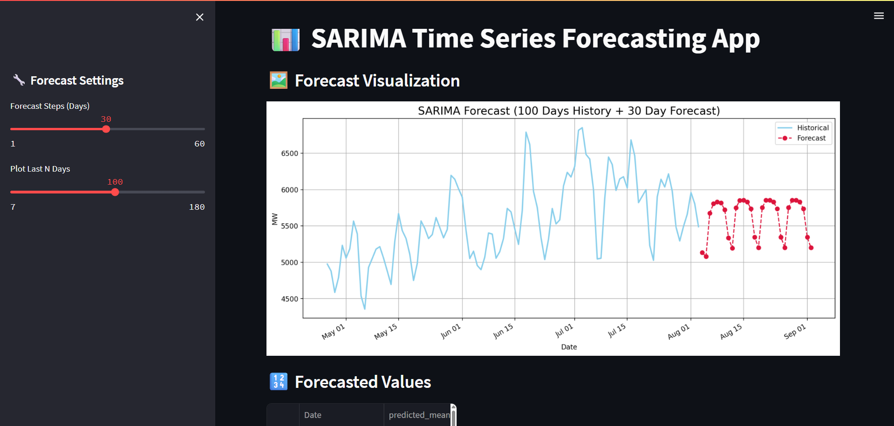

## 🚀 Getting Started

Follow the steps below to run the project end-to-end:

### ✅ Steps to Run the Project

1. **Download the Repository**
   - Clone or download this repository to your local machine.

2. **Run the Jupyter Notebook**
   - Open and execute the notebook file (`.ipynb`) to train the model.

3. **Save the Trained Model**
   - At the end of the notebook, save the trained model (e.g., `model.h5`) into the **same folder** as `app.py`.

4. **Set Up the Environment**
   - Install required dependencies using the `requirements.txt` file:
     ```bash
     pip install -r requirements.txt
     ```

5. **Run the Streamlit App**
   - Activate your environment (if using virtualenv/conda), then run:
     ```bash
     streamlit run app.py
     ```

---

## 📸 Output Samples

### 🔹 Forecast Visualization – Part 1  


### 🔹 Forecast Visualization – Part 2  


---

## 🎥 Demo Video

### 🔹 Forecast Application Demo

[](images/Project%20Forecasting%20Demo%20Video.mp4)  
▶️ **Click the image or [this link](images/Project%20Forecasting%20Demo%20Video.mp4) to watch the video demo**

---

